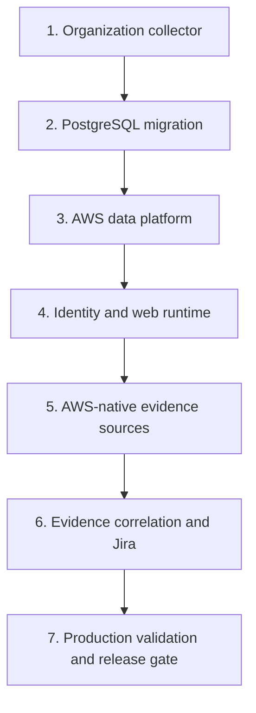

# AWS deployment guide

This guide describes the target stack order. The scripts package and deploy
infrastructure but do not copy local AWS credentials into Gatewatch.

## Prerequisites

- AWS Organizations with all features enabled.
- CloudFormation StackSets trusted access enabled.
- A management account deployment (`SELF`) or registered delegated admin
  (`DELEGATED_ADMIN`).
- AWS CLI v2 and an authenticated profile with MFA/session credentials.
- Node.js 22.13+, `zip`, `jq`, and `shasum` locally.
- VPC and at least two private subnets for Aurora when deploying the platform.
- A Route 53 public hosted zone, a public application hostname, and a separate
  origin hostname.
- A public Route 53 hosted zone in the deployment account. The stack requests
  and DNS-validates separate ACM certificates for the public and private-origin
  hostnames.
- Reviewed digest-pinned Node.js and oauth2-proxy container image references.
- A reviewed organization root/OU allowlist and account exclusion list.

Do not use a profile affected by an identity-policy explicit deny that blocks
the required deployment APIs. An explicit deny cannot be overridden by adding
an allow policy.

## Stack order



## 1. Deploy the organization collector

Set the target root or OUs explicitly:

```bash
export AWS_PROFILE=personal
export AWS_REGION=us-east-1
export GATEWATCH_ORGANIZATION_TARGET_IDS=r-abcd
export GATEWATCH_STACKSET_CALL_AS=SELF
export GATEWATCH_REGION_ALLOW_LIST=us-east-1,us-east-2,us-west-2,eu-west-1
./scripts/deploy-aws-organization.sh
```

For a delegated administrator, use `DELEGATED_ADMIN`. The deployment script:

1. packages only `index.py`;
2. calculates SHA-256 and uses a content-addressed S3 key;
3. validates the CloudFormation template;
4. deploys the read-role StackSet and central collection resources;
5. starts an initial Step Functions execution.

Record these outputs:

- `EvidenceBucketName`
- `EvidenceKeyArn`
- `CollectionStateMachineArn`
- `CollectionRunTableName`

## 2. Apply the PostgreSQL schema

Apply the migrations in filename order through a controlled migration identity:

1. [`0001_gatewatch_aws.sql`](../../db/postgres/0001_gatewatch_aws.sql) creates
   the ingestion, inventory, finding, workflow, and evidence base.
2. [`0002_organization_operations.sql`](../../db/postgres/0002_organization_operations.sql)
   creates account context, correlation mappings, monitors and runs, export
   jobs, retention, legal holds, risk policies, and semantic event provenance.
3. [`0003_finding_search.sql`](../../db/postgres/0003_finding_search.sql) adds
   queue-ordering, observation-history, universal-evidence, resource-name,
   tag, JSONB, and trigram indexes for bounded organization-scale search.
4. [`0004_bedrock_ai_analyst.sql`](../../db/postgres/0004_bedrock_ai_analyst.sql)
   adds bounded AI analysis, feedback, and usage records.
5. [`0005_security_governance.sql`](../../db/postgres/0005_security_governance.sql)
   forces RLS on every workspace table, creates non-owner workload roles,
   makes database audit history append-only, and installs bounded,
   legal-hold-aware retention.
6. [`0006_exposure_operations.sql`](../../db/postgres/0006_exposure_operations.sql)
   adds AWS verification runs, provider correlations, graph edges, governed
   remediation, owner actions, incidents, policy packs, exposure SLO snapshots,
   and enrichment extensions with forced workspace isolation.
7. [`0007_azure_data_explorer_sources.sql`](../../db/postgres/0007_azure_data_explorer_sources.sql)
   adds provider-aware ADX source metadata, expands the supported AWS evidence
   types, and creates a durable forced-RLS polling checkpoint table.

The governance migration and each later product migration enable and force
row-level security on every workspace-scoped table. Each application
transaction must set `app.workspace_id`; a missing or incorrect workspace
context therefore fails closed. The deployment creates separate non-owner login
principals for ingestion and maintenance. Workload credentials must never be
changed to the Aurora master secret or granted `BYPASSRLS`, table ownership, or
schema-administration privileges.

## 3. Deploy the data platform

Package `infrastructure/lambda/ingest`, `backfill`, and
`governance-maintenance` with lockfile-based installs. Upload each artifact
under an immutable versioned key. Pass the organization evidence bucket and key outputs to
`gatewatch-aws-platform.yaml`:

```text
OrganizationEvidenceBucketName=<collector EvidenceBucketName>
OrganizationEvidenceKeyArn=<collector EvidenceKeyArn>
WorkspaceId=<workspace UUID from migration 0001>
GovernanceMaintenanceArtifactKey=<versioned maintenance zip key>
```

The platform creates the EventBridge rule that forwards only canonical shard
and run-manifest object keys to SQS. Confirm the queue policy source ARN and
source account after deployment. The platform also creates deletion-protected
Aurora with 35-day recovery, RDS-managed master credentials, separate non-owner
workload credentials, a compliance-mode Object Lock audit bucket, and an hourly
single-concurrency maintenance worker with retries, a DLQ, and an alarm. The
worker archives unexported audit rows before enforcing retention. Every SQS
queue uses the dedicated rotating customer-managed queue key, every Lambda has
active X-Ray tracing, and the audit archive writes server access logs to a
separate retained SSE-S3 bucket. Cross-account forwarding stacks must receive
both the ingestion queue ARN and the `QueueKeyArn` platform output.

The Object Lock retention value is irreversible for protected object versions.
Validate the compliance requirement and cost before deployment.

## 4. Deploy the identity and web stack

The CloudFront-scoped WAF requires this stack to run in `us-east-1`. First,
check out the exact current `main` commit and download the image artifact from
that commit's successful `Gatewatch release artifact security` workflow. The
workflow builds the final image, blocks unresolved Critical/High findings,
emits a CycloneDX SBOM, and signs GitHub/Sigstore build provenance.

Then configure the named administrator, DNS, certificates, and immutable
container images:

```bash
export AWS_PROFILE=personal
export AWS_REGION=us-east-1
export GATEWATCH_PUBLIC_DOMAIN_NAME=gatewatch.example.com
export GATEWATCH_ORIGIN_DOMAIN_NAME=gatewatch-origin.example.com
export GATEWATCH_HOSTED_ZONE_ID=Z0123456789EXAMPLE
export GATEWATCH_BOOTSTRAP_ADMIN_EMAIL=security-admin@example.com
export GATEWATCH_COGNITO_DOMAIN_PREFIX=gatewatch-example
export GATEWATCH_OAUTH2_PROXY_IMAGE=quay.io/oauth2-proxy/oauth2-proxy@sha256:...
export GATEWATCH_RELEASE_IMAGE_ARCHIVE=/secure/path/gatewatch-web.tar.gz
export GATEWATCH_RELEASE_IMAGE_REF=gatewatch-web:$(git rev-parse HEAD)
export GATEWATCH_RELEASE_PRINCIPAL_ARN=arn:aws:iam::111122223333:role/GatewatchRelease
export GATEWATCH_SOURCE_ORGANIZATION_ID=o-example123456
./scripts/deploy-aws-web.sh
```

The script fails before changing AWS unless the checkout is clean, its commit is
the freshly fetched `origin/main`, and GitHub verifies the image's provenance
against the expected workflow, main ref, source commit, and GitHub-hosted runner.
It packages only that reviewed Git tree, uploads content-addressed source and
prebuilt image artifacts to a versioned S3 bucket, and passes each exact VersionId
and SHA-256 to CloudFormation. SSM downloads and verifies both. The installer
loads the image archive and never runs a package manager or source build.
The artifact-bucket policy permits release writes only from the configured
publisher principal, denies deletion of release versions, and denies plaintext
transport; use a dedicated, monitored release role in production.

The data-platform stack must be deployed first. The web deployment reads its
`AuditArchiveBucketName`, `PlatformKeyArn`, and `WorkspaceId` outputs. The AWS
bridge receives write-only permission to the application audit prefix. Each
privileged action records the immutable Cognito subject locally and atomically
queues the same event for Object Lock archival; failed deliveries remain in a
bounded backoff outbox and are retried on subsequent audited activity.

The stack creates a Cognito user pool with named users, mandatory TOTP MFA,
15-minute access and ID tokens, authorization-code flow, PKCE, and token
revocation. CloudFront is protected by managed WAF rules and rate limiting;
both viewer-to-edge and edge-to-ALB connections require TLS. The ALB is an
internal CloudFront VPC origin in two private subnets, so it has no public
route or directly reachable endpoint. The EC2 web
security group accepts traffic only from the ALB, and Nginx verifies a generated
origin header on every non-health request.
The ALB spans two public subnets, while the EC2 runtime and encrypted EFS mount
remain in a private subnet without public addresses. A managed NAT gateway
provides outbound-only TLS for AWS APIs, Cognito, Jira, and the pinned OIDC
image registry; security-group egress is limited to TCP 443 and the EFS mount.

CloudFormation creates the bootstrap user and Cognito sends a temporary
password. The user must choose a new password and enroll TOTP on first sign-in.
Create additional named users through the controlled administrator process; do
not share the bootstrap identity.

The application uses a multi-stage, digest-pinned image and a Next.js standalone
production server. A small Node SQLite adapter provides the D1-compatible storage
API over the encrypted EFS volume; the web process does not run Wrangler or a
development server. The web, AWS bridge, and OIDC containers have read-only root
filesystems, dropped capabilities, `no-new-privileges`, PID/CPU/memory limits,
and isolated fixed addresses. Only the bridge can reach IMDS, and it immediately
assumes a dedicated least-privilege runtime role; web and OIDC access to IMDS is
blocked at both SDK and network layers.

## 5. Connect AWS-native evidence

- Prefer an organization trail delivered to a central log-archive bucket.
- Prefer an organization Config aggregator/history source.
- Add VPC and Transit Gateway Flow Logs as observed-traffic evidence.
- Add Reachability Analyzer and Network Access Analyzer exports as static path
  evidence, without treating them as proof that traffic occurred.
- Add ELB, WAF, CloudFront, API Gateway, Route 53 Resolver, and Network Firewall
  logs only where those services are in the protected path.
- Add GuardDuty, Security Hub, and Inspector findings as threat enrichment, not
  as the source of truth for security-group configuration or reachability.
- Use a dedicated `GatewatchLogReadRole` per source account/bucket.
- Generate the template from Admin, review the JSON policy, and validate it with
  IAM Access Analyzer before deployment.
- Activate a source only after live STS, list, bounded read, and KMS tests pass.

### Azure Data Explorer source

If the same AWS logs are centralized in ADX, deploy the current web stack so it
creates `AzureDataExplorerCredentialsSecret` and the five-minute private sync
association. In **Administration → Data sources**, choose Azure Data Explorer,
then specify the cluster, database, table, timestamp column, evidence type, and
row mapping.

Create a dedicated Microsoft Entra application and grant it `viewer` access to
only the selected ADX database. Enter its tenant ID, client ID, and secret in
the source wizard. The bridge stores one credential object under that source ID
inside Secrets Manager; the application database stores only tenant/client IDs.
Run **Test connection**, inspect **Preview rows**, activate the source, then run
the initial synchronization.

For Private Link clusters, verify that the Gatewatch private subnet resolves and
routes to the validated `*.kusto.*` hostname over TCP 443. Do not add an arbitrary
proxy or custom cluster domain; the bridge intentionally rejects them.

## Validation checklist

- [ ] StackSet instances are current for every selected account.
- [ ] A newly added OU account receives the member role automatically.
- [ ] Initial run manifest lists every expected account.
- [ ] Failed accounts/Regions appear in Coverage and do not disappear from totals.
- [ ] Every successful target has an S3 key and SHA-256.
- [ ] Duplicate S3 events do not create duplicate observation rows.
- [ ] Malformed or excessive shards reach the DLQ without partial rows.
- [ ] The platform queue cannot be written by an unapproved principal/rule.
- [ ] All three queues report the expected `QueueKeyArn`, and an unapproved
  principal cannot use that key for `Decrypt` or `GenerateDataKey`.
- [ ] Audit archive server access logs arrive under `audit-archive-access/` in
  the dedicated access-log bucket.
- [ ] All four platform Lambdas emit active X-Ray traces without IAM denials.
- [ ] Artifact checksum/version mismatch causes web deployment to fail.
- [ ] Snapshot checksum mismatch causes `/api/aws-inventory` to fail closed.
- [ ] Administrator and workflow audit events identify the Cognito subject and
  verified email for each unique user.
- [ ] Cognito rejects sign-in until the bootstrap user enrolls TOTP MFA.
- [ ] Revoked Cognito refresh tokens cannot obtain a new session.
- [ ] Direct requests to the ALB fail unless they arrive from CloudFront and
  contain the generated origin verification header.
- [ ] WAF rate limits abusive clients and redacts authorization and cookie data
  from security logs.
- [ ] CloudFront access logs arrive in the retained encrypted log bucket.
- [ ] Two Cognito users produce distinct `sub` actor values even if a display
  name changes, and a spoofed viewer identity header never reaches the app.
- [ ] Removing the bootstrap administrator's stored role removes access; the
  deployment email is not a permanent authorization bypass.
- [ ] Denying audit-bucket `PutObject` leaves an outbox row; restoring access
  archives a version and records its version ID without duplicating the local event.
- [ ] Web and bridge IAM cannot read, overwrite in place, shorten retention, or
  delete an archived audit object version.
- [ ] `app.workspace_id` is set on every Aurora application transaction and a
  cross-workspace query is rejected by row-level security.
- [ ] Ingestion and maintenance database principals report `rolsuper=false`,
  `rolbypassrls=false`, and own no application tables.
- [ ] Workload attempts to update, delete, or truncate `audit_events` fail.
- [ ] Every audit event has an immutable S3 version and archive-ledger row before
  it becomes eligible for database retention.
- [ ] Expired evidence is deleted in bounded batches while matching legal holds
  preserve workspace, account, security-group, finding, and export records.
- [ ] Aurora deletion is refused, the restorable time advances, and a quarterly
  point-in-time restore to an isolated cluster passes consistency checks.
- [ ] Account catalog changes appear in findings facets and groupings.
- [ ] Revoked correlation mappings are excluded from reprocessing.
- [ ] Monitor transitions create durable runs and notification outbox entries.
- [ ] Active legal holds prevent matching evidence and export deletion.
- [ ] Active risk-policy weights change finding scores deterministically.
- [ ] The web stack outputs the approved Bedrock model, Guardrail ID, and immutable
  Guardrail version.
- [ ] The EC2 role can invoke the approved inference profile but not an unrelated model.
- [ ] A finding AI analysis returns schema `1.0`, valid evidence references, the exact
  deterministic verdict, and an `ai.analysis.generated` audit event.
- [ ] Prompt-like AWS metadata is blocked or safely analyzed without changing the verdict.
- [ ] Disabling Bedrock produces a labeled deterministic fallback and does not affect findings.
- [ ] Parallel requests stop at the per-user/workspace daily counters.
- [ ] The ADX credential is absent from browser responses, SQLite, Aurora, and logs.
- [ ] An ADX application with database `viewer` access can test and preview, while
  the same identity cannot execute management commands or write to the table.
- [ ] Non-Kusto URLs, URL credentials, paths, redirects, and injected table or
  column identifiers are rejected before any outbound request.
- [ ] Manual and scheduled ADX syncs advance the timestamp checkpoint only after
  evidence writes complete, and replayed rows do not create duplicate evidence.
- [ ] Oversized, malformed, throttled, or unauthorized ADX responses create a
  failed run and degraded source without exposing tokens or provider internals.

## Rollback

- Roll back application code by deploying a previously approved artifact
  VersionId and digest.
- Do not delete the evidence bucket, KMS key, run table, or Aurora during rollback.
- Disable the schedule to stop new collection while preserving historical runs.
- Pause ingestion event-source mapping if a parser defect is suspected; do not
  purge the queue until objects can be replayed.
- Restore Aurora to a separate cluster for validation before promoting a restore.
