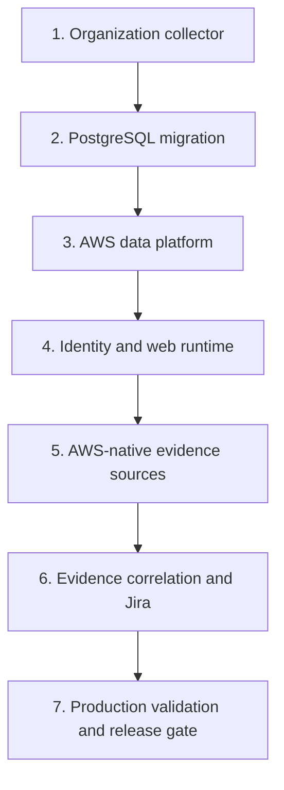

# AWS deployment guide

This guide describes the target stack order. The scripts package and deploy
infrastructure but do not copy local AWS credentials into Gatewatch.

## Prerequisites

- AWS Organizations with all features enabled.
- CloudFormation StackSets trusted access enabled.
- A management account deployment (`SELF`) or registered delegated admin
  (`DELEGATED_ADMIN`).
- AWS CLI v2 and an authenticated profile with MFA/session credentials.
- Node.js 22.13+, `zip`, `jq`, and `shasum` locally.
- VPC and at least two private subnets for Aurora when deploying the platform.
- A reviewed organization root/OU allowlist and account exclusion list.

Do not use a profile affected by an identity-policy explicit deny that blocks
the required deployment APIs. An explicit deny cannot be overridden by adding
an allow policy.

## Stack order



## 1. Deploy the organization collector

Set the target root or OUs explicitly:

```bash
export AWS_PROFILE=personal
export AWS_REGION=us-east-1
export GATEWATCH_ORGANIZATION_TARGET_IDS=r-abcd
export GATEWATCH_STACKSET_CALL_AS=SELF
export GATEWATCH_REGION_ALLOW_LIST=us-east-1,us-east-2,us-west-2,eu-west-1
./scripts/deploy-aws-organization.sh
```

For a delegated administrator, use `DELEGATED_ADMIN`. The deployment script:

1. packages only `index.py`;
2. calculates SHA-256 and uses a content-addressed S3 key;
3. validates the CloudFormation template;
4. deploys the read-role StackSet and central collection resources;
5. starts an initial Step Functions execution.

Record these outputs:

- `EvidenceBucketName`
- `EvidenceKeyArn`
- `CollectionStateMachineArn`
- `CollectionRunTableName`

## 2. Apply the PostgreSQL schema

Apply the migrations in filename order through a controlled migration identity:

1. [`0001_gatewatch_aws.sql`](../../db/postgres/0001_gatewatch_aws.sql) creates
   the ingestion, inventory, finding, workflow, and evidence base.
2. [`0002_organization_operations.sql`](../../db/postgres/0002_organization_operations.sql)
   creates account context, correlation mappings, monitors and runs, export
   jobs, retention, legal holds, risk policies, and semantic event provenance.
3. [`0003_finding_search.sql`](../../db/postgres/0003_finding_search.sql) adds
   queue-ordering, observation-history, universal-evidence, resource-name,
   tag, JSONB, and trigram indexes for bounded organization-scale search.
4. [`0004_bedrock_ai_analyst.sql`](../../db/postgres/0004_bedrock_ai_analyst.sql)
   adds bounded AI analysis, feedback, and usage records.
5. [`0005_security_governance.sql`](../../db/postgres/0005_security_governance.sql)
   forces RLS on every workspace table, creates non-owner workload roles,
   makes database audit history append-only, and installs bounded,
   legal-hold-aware retention.

The final migration discovers every workspace-scoped table, enables and forces
row-level security, and replaces its workspace policy. Each application
transaction must set `app.workspace_id`; a missing or incorrect workspace
context therefore fails closed. The deployment creates separate non-owner login
principals for ingestion and maintenance. Workload credentials must never be
changed to the Aurora master secret or granted `BYPASSRLS`, table ownership, or
schema-administration privileges.

## 3. Deploy the data platform

Package `infrastructure/lambda/ingest`, `backfill`, and
`governance-maintenance` with lockfile-based installs. Upload each artifact
under an immutable versioned key. Pass the organization evidence bucket and key outputs to
`gatewatch-aws-platform.yaml`:

```text
OrganizationEvidenceBucketName=<collector EvidenceBucketName>
OrganizationEvidenceKeyArn=<collector EvidenceKeyArn>
WorkspaceId=<workspace UUID from migration 0001>
GovernanceMaintenanceArtifactKey=<versioned maintenance zip key>
```

The platform creates the EventBridge rule that forwards only canonical shard
and run-manifest object keys to SQS. Confirm the queue policy source ARN and
source account after deployment. The platform also creates deletion-protected
Aurora with 35-day recovery, RDS-managed master credentials, separate non-owner
workload credentials, a compliance-mode Object Lock audit bucket, and an hourly
single-concurrency maintenance worker with retries, a DLQ, and an alarm. The
worker archives unexported audit rows before enforcing retention. Every SQS
queue uses the dedicated rotating customer-managed queue key, every Lambda has
active X-Ray tracing, and the audit archive writes server access logs to a
separate retained SSE-S3 bucket. Cross-account forwarding stacks must receive
both the ingestion queue ARN and the `QueueKeyArn` platform output.

The Object Lock retention value is irreversible for protected object versions.
Validate the compliance requirement and cost before deployment.

## 4. Deploy the transitional web stack

For the existing small-team web path:

```bash
./scripts/deploy-aws-web.sh
```

The script uploads a content-addressed release to a versioned bucket, captures
the exact S3 VersionId, and passes both VersionId and SHA-256 to CloudFormation.
The SSM installer downloads that version and verifies the digest before unzip or
execution.

This web stack still uses a shared Basic Auth administrator and an HTTP origin.
It is suitable only as a transitional, access-restricted environment. Before
authoritative multi-account governance, replace it with individual OIDC/MFA,
TLS to the origin, separate web/bridge task roles, WAF/rate limiting, and a
production runtime as described in the security roadmap.

## 5. Connect AWS-native evidence

- Prefer an organization trail delivered to a central log-archive bucket.
- Prefer an organization Config aggregator/history source.
- Add VPC and Transit Gateway Flow Logs as observed-traffic evidence.
- Add Reachability Analyzer and Network Access Analyzer exports as static path
  evidence, without treating them as proof that traffic occurred.
- Add ELB, WAF, CloudFront, API Gateway, Route 53 Resolver, and Network Firewall
  logs only where those services are in the protected path.
- Add GuardDuty, Security Hub, and Inspector findings as threat enrichment, not
  as the source of truth for security-group configuration or reachability.
- Use a dedicated `GatewatchLogReadRole` per source account/bucket.
- Generate the template from Admin, review the JSON policy, and validate it with
  IAM Access Analyzer before deployment.
- Activate a source only after live STS, list, bounded read, and KMS tests pass.

## Validation checklist

- [ ] StackSet instances are current for every selected account.
- [ ] A newly added OU account receives the member role automatically.
- [ ] Initial run manifest lists every expected account.
- [ ] Failed accounts/Regions appear in Coverage and do not disappear from totals.
- [ ] Every successful target has an S3 key and SHA-256.
- [ ] Duplicate S3 events do not create duplicate observation rows.
- [ ] Malformed or excessive shards reach the DLQ without partial rows.
- [ ] The platform queue cannot be written by an unapproved principal/rule.
- [ ] All three queues report the expected `QueueKeyArn`, and an unapproved
  principal cannot use that key for `Decrypt` or `GenerateDataKey`.
- [ ] Audit archive server access logs arrive under `audit-archive-access/` in
  the dedicated access-log bucket.
- [ ] All four platform Lambdas emit active X-Ray traces without IAM denials.
- [ ] Artifact checksum/version mismatch causes web deployment to fail.
- [ ] Snapshot checksum mismatch causes `/api/aws-inventory` to fail closed.
- [ ] Administrator and workflow audit events identify unique users (required
  after OIDC implementation).
- [ ] `app.workspace_id` is set on every Aurora application transaction and a
  cross-workspace query is rejected by row-level security.
- [ ] Ingestion and maintenance database principals report `rolsuper=false`,
  `rolbypassrls=false`, and own no application tables.
- [ ] Workload attempts to update, delete, or truncate `audit_events` fail.
- [ ] Every audit event has an immutable S3 version and archive-ledger row before
  it becomes eligible for database retention.
- [ ] Expired evidence is deleted in bounded batches while matching legal holds
  preserve workspace, account, security-group, finding, and export records.
- [ ] Aurora deletion is refused, the restorable time advances, and a quarterly
  point-in-time restore to an isolated cluster passes consistency checks.
- [ ] Account catalog changes appear in findings facets and groupings.
- [ ] Revoked correlation mappings are excluded from reprocessing.
- [ ] Monitor transitions create durable runs and notification outbox entries.
- [ ] Active legal holds prevent matching evidence and export deletion.
- [ ] Active risk-policy weights change finding scores deterministically.
- [ ] The web stack outputs the approved Bedrock model, Guardrail ID, and immutable
  Guardrail version.
- [ ] The EC2 role can invoke the approved inference profile but not an unrelated model.
- [ ] A finding AI analysis returns schema `1.0`, valid evidence references, the exact
  deterministic verdict, and an `ai.analysis.generated` audit event.
- [ ] Prompt-like AWS metadata is blocked or safely analyzed without changing the verdict.
- [ ] Disabling Bedrock produces a labeled deterministic fallback and does not affect findings.
- [ ] Parallel requests stop at the per-user/workspace daily counters.

## Rollback

- Roll back application code by deploying a previously approved artifact
  VersionId and digest.
- Do not delete the evidence bucket, KMS key, run table, or Aurora during rollback.
- Disable the schedule to stop new collection while preserving historical runs.
- Pause ingestion event-source mapping if a parser defect is suspected; do not
  purge the queue until objects can be replayed.
- Restore Aurora to a separate cluster for validation before promoting a restore.
