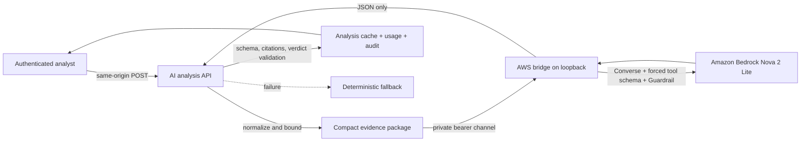

# Bedrock AI security analyst

**Release:** August 9, 2026
**Status:** production-enabled in the AWS web stack; advisory only

## Product boundary

The Bedrock analyst helps a cloud-security analyst understand already-normalized
Gatewatch evidence. It is not a finding engine, policy engine, reachability
engine, approval authority, or deployment agent. Gatewatch's deterministic
correlation remains authoritative for the security-group ARN, exposure lane,
risk score, evidence completeness, workflow state, and remediation verification.

Supported workflows:

1. explain one consolidated security-group finding;
2. summarize up to 25 current queue findings as a daily digest;
3. compare the contributing findings in one security-group cluster;
4. translate a natural-language hunt into the visible deterministic query language;
5. draft review-only CloudFormation and Terraform remediation guidance.

The UI labels Bedrock and deterministic fallback output separately. Generated
actions always say **Approval required** and no AI API has permission or code to
change an AWS resource or a Gatewatch finding decision.

## Data flow and trust boundaries

AWS-controlled strings, tags, resource names, owners, intent text, and source
records are attacker-controlled at the model boundary. The route sends only a
compact structure produced by `buildAiEvidencePackage`; it never includes the raw
uploaded log, `evidenceSnapshot`, credentials, application secrets, other users'
notes, or evidence unrelated to the requested findings. Each value is length
bounded and control characters are removed.

The prompt encloses data in an `untrusted_evidence_json` boundary, escapes markup,
and says that all values are inert data. Prompt-like text produces an input
warning. Bedrock Guardrails independently applies a high-strength input prompt
attack filter. A guardrail block, timeout, malformed response, unsupported model,
or validation failure returns the deterministic fallback—not a partial model answer.

## Output contract

Bedrock Converse forces the model to call `submit_gatewatch_analysis` with a
strict JSON Schema as the tool input. The server then validates the returned
object again independently. The contract limits:

- 12 evidence-cited claims;
- 10 contradictions, 12 evidence gaps, and 10 recommended actions;
- confidence to 0–100;
- claims to `observed` or `inferred`;
- action priority to `now`, `next`, or `later`;
- remediation text to bounded review-only strings;
- hunt output to syntax accepted by Gatewatch's deterministic query parser;
- properties to the explicit schema (`additionalProperties: false`).

Claim references must match evidence IDs supplied in the request. For a single
finding, the returned deterministic verdict must exactly equal the normalized
verdict. The server overwrites every `requiresApproval` value with `true`, even if
a model tries to return `false`. React renders output as text, so remediation code
is not interpreted as HTML. Copying a draft does not execute it.

## Model and IAM policy

The deployed model is the US cross-Region inference profile
`us.amazon.nova-2-lite-v1:0`. It was selected for low-cost, text-focused security
analysis and verified Converse forced-tool-schema support. The CloudFormation
parameter is allowlisted to that value; it is not browser configurable.

The EC2 workload role can invoke only:

- the named account inference profile; and
- the Nova 2 Lite destination model ARNs in `us-east-1`, `us-east-2`, and
  `us-west-2` required by that profile.

`bedrock:ApplyGuardrail` is scoped to the stack-created guardrail ARN. There is no
wildcard Bedrock resource and no Bedrock permission in the browser-facing app.
Model and guardrail identifiers cross the private bridge as deployment-provided
environment variables. The bridge listens on loopback and requires a constant
service bearer token.

## Availability, cache, and cost controls

- request body: 60 KB at the web route and 96 KB at the bridge;
- findings per request: 25;
- model output: 4,000 tokens and 64 KB;
- bridge timeout: 90 seconds;
- personal budget: 100 uncached requests per UTC day;
- workspace budget: 500 uncached requests per UTC day;
- successful Bedrock cache: seven days, keyed by analysis mode, normalized
  evidence, question, prompt version, model ID, and Guardrail version;
- deterministic fallback cache: five minutes, so a transient model outage does
  not suppress a recovered Bedrock path;
- temperature: 0; top-p: 0.2;
- cache hits do not consume a request reservation;
- request counters are conditionally and atomically reserved before inference so
  parallel calls cannot bypass the limits.

Usage records retain counts, token totals, model ID, latency, source, versioned
prompt/schema IDs, guardrail result, actor, evidence hash, and timestamps. They do
not retain raw source logs. The administrator integration view reports service
health and current daily usage. CloudWatch receives bridge errors without the
model prompt or output.

## Authorization and audit

Only authenticated users with `intelligence.write` may invoke analysis or submit
feedback. The POST route enforces the central permission service and same-origin
protection. Finding input is accepted only as a bounded normalized `DailyFinding`
shape; model output is advisory and cannot mutate the supplied record.

Each fresh analysis records an `ai.analysis.generated` audit event. Feedback
records `useful`, `incorrect`, or `incomplete` per actor and analysis and is
upserted to prevent feedback spam. Cached reads and status checks are read-only.

## Failure behavior

The deterministic product does not depend on Bedrock. If Bedrock is disabled,
throttled, blocked by the guardrail, malformed, unreachable, over budget, or
returns an ungrounded claim, Gatewatch either:

- returns a locally generated deterministic explanation for an analysis request;
  or
- returns a clear budget/authorization error while the normal findings workflow
  remains available.

Never reduce an exposure severity, accept risk, resolve a finding, or apply a
change because of an AI answer. Analysts must inspect cited evidence and use the
existing structured decision workflow.

## Operating and evaluation procedure

Before changing the model, prompt, schema, or guardrail:

1. increment the prompt or schema version so stale cache entries cannot cross the
   policy boundary;
2. run the AI security unit tests and the complete application suite;
3. evaluate representative confirmed, internal, unknown, IPv6, stale-evidence,
   malicious-metadata, and cross-account fixtures;
4. require 100% preservation of deterministic verdicts and valid citations;
5. compare incorrect/incomplete feedback against the previous version;
6. deploy to a non-production stack, invoke one analysis, and inspect usage,
   guardrail, audit, fallback, and latency behavior;
7. promote through reviewed CloudFormation only.

Model output is not used to train or tune a model automatically. Feedback is an
evaluation signal requiring human review.

## Known limitations

- Bedrock can explain only evidence Gatewatch already normalized; it cannot fill a
  missing route table, public-address, NACL, flow, or Config observation.
- A valid citation proves that the statement references supplied evidence, not
  that the model's interpretation is correct.
- Natural-language hunts are constrained to the existing deterministic fields.
- Remediation drafts may be syntactically incomplete when the source evidence does
  not contain a resolvable IaC resource address.
- The current AWS web deployment uses transitional shared Basic authentication;
  individual OIDC/MFA remains a required production-hardening item.
