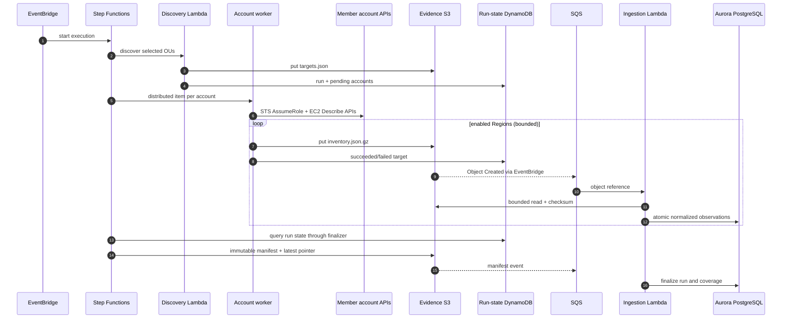
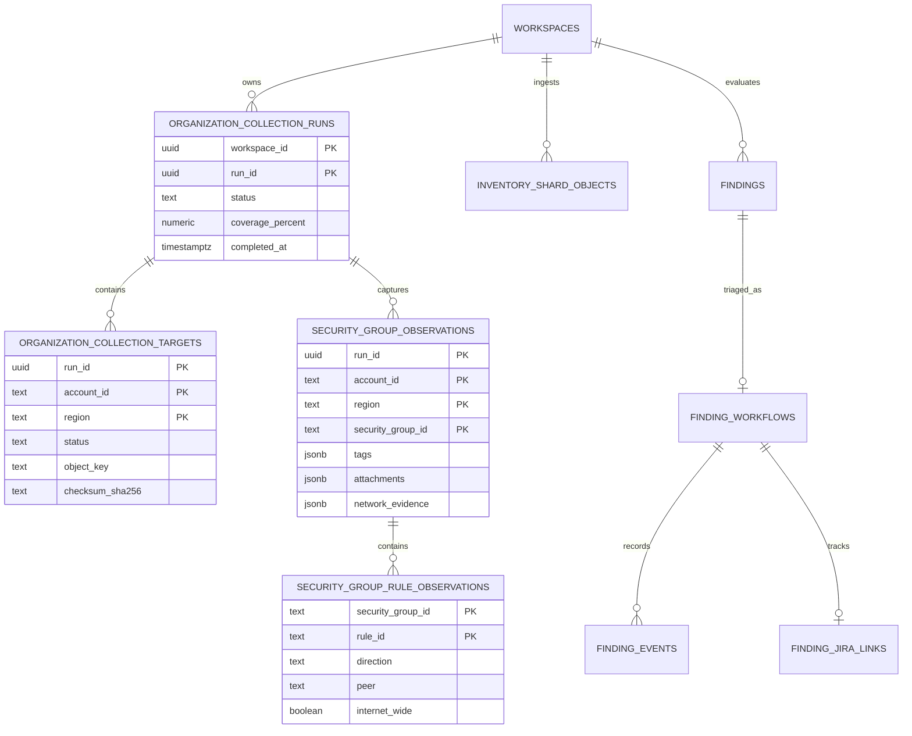

# Data pipeline and model

## Canonical identities

Never identify a resource with only `sg-...`. Security-group identifiers are
unique only within an account/Region context. Gatewatch uses:

```text
aws:<account-id>:<region>:<vpc-id>:<security-group-id>
```

An observation is additionally scoped by `workspace_id` and `run_id`. Finding
fingerprints include the canonical resource identity plus the normalized rule or
policy signature so state survives repeated observations and reopens.

## Shard contract

Top-level inventory shard fields:

| Field | Meaning |
|---|---|
| `schemaVersion` | `2.0` |
| `evidenceType` | `security-group-inventory-shard` |
| `runId` | UUID shared by the organization run |
| `observedAt` | UTC time used for every observation in the shard |
| `target` | Account, name, Region, and target ID |
| `coverage` | Group/rule/ENI/route/subnet/NACL/IGW counts |
| `securityGroups` | Normalized groups, rules, attachments, tags, and network evidence |

The raw shard is authoritative. Normalized rows can be rebuilt from S3.

## Data flow



## PostgreSQL entities



### Raw evidence and ledgers

- `inventory_shard_objects` provides duplicate detection, checksum, status, and
  failure code for each S3 key/version.
- `ingested_objects` performs the same role for CloudTrail and Config sources.
- Raw objects are not copied into PostgreSQL.

### Observations and current views

- `security_group_observations` stores group identity, tags, attachment evidence,
  counts, and network evidence for one run.
- `security_group_rule_observations` stores individual normalized peers and an
  explicit `internet_wide` flag.
- `current_security_groups` and `current_security_group_rules` select the newest
  usable observation without deleting historical rows.

### Attribution and history

- `config_items` stores normalized AWS Config items and resource history.
- `cloudtrail_events` stores only security-group-relevant management events.
- `aws_evidence_records` stores bounded normalized fields and the original AWS
  record payload for Flow Logs, network analyses, service access logs, and
  managed security findings. Its evidence class prevents observed traffic,
  static reachability, service access, and threat findings from being conflated.
- `security_group_rule_versions` provides valid-from/valid-to state.
- `gatewatch_correlate_cloudtrail_event` connects a successful change to a rule
  observation within a bounded time window.

### Human governance

`finding_workflows`, `finding_events`, `resource_reviews`, exception records,
Jira links, campaigns, remediation requests, and audit events are durable human
state. Re-normalizing AWS evidence must never delete this history.

## Idempotency and ordering

- S3 and EventBridge are at-least-once; object ledgers use key plus version.
- Shards and manifests may arrive in either order.
- A run placeholder is created when the first shard arrives.
- A manifest upsert finalizes counts without invalidating late shard writes.
- Observation primary keys include run ID, making replay safe.
- Current views order by source observation time, not ingestion time.

## Retention

Recommended starting policy:

| Data | Default | Rationale |
|---|---:|---|
| Immutable S3 run evidence | 400 days | Year-over-year audit and incident lookback |
| Step Functions result objects | 30 days | Debugging only |
| CloudTrail/Config normalized history | 400 days | Match evidence window |
| Current observations | Indefinite while resource exists | Daily posture |
| Human review and audit decisions | Policy-defined, usually 3–7 years | Governance evidence |
| Application logs | 90 days hot, longer in security archive | Operational and incident response |

Retention requires scheduled database maintenance and legal-hold semantics before
multi-tenant production; changing an admin setting alone is not a purge control.
