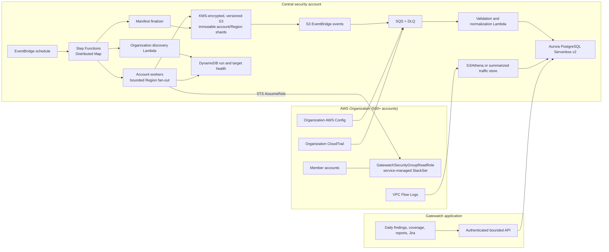

# Organization-scale architecture

## Outcome

The architecture supports security-group governance across 500+ AWS accounts
without deploying a custom collector application in every account. One
service-managed StackSet deploys a narrow read role; a central collection plane
assumes that role and writes isolated evidence shards.

The primary question Gatewatch answers is not merely “does a rule contain
`0.0.0.0/0`?” It answers:

- what ingress and egress are configured now;
- which resource is attached, including its name and tags;
- whether attached subnets have a configured internet path;
- whether the access was observed in traffic;
- who changed it and through which delivery channel;
- whether an owner reviewed or accepted the risk;
- whether evidence is complete enough to trust the conclusion.

## System architecture



## Evidence hierarchy

| Evidence | What it can prove | What it cannot prove alone |
|---|---|---|
| EC2 Describe APIs | Current groups, rules, ENIs, subnets, routes, NACLs, public addresses | Who changed a rule or whether traffic succeeded |
| AWS Config | Configuration history, resource relationships, drift time | Caller identity or observed network use |
| CloudTrail | API caller, event, time, source IP, success/failure, delivery channel clues | Current state after later changes |
| Route/NACL/public-address analysis | A configured path can exist | A process is listening or a packet succeeded |
| VPC Flow Logs | Accepted/rejected observed tuples in the retained window | Business authorization or future reachability |
| Tags/CMDB/application policy | Owner, application, environment, approved intent | Actual AWS configuration or traffic |
| Analyst decisions/Jira | Human disposition and remediation accountability | Technical truth without linked evidence |

Gatewatch preserves these semantics separately. “Configured,” “reachable,”
“observed,” “attributed,” “authorized,” and “complete” are not interchangeable.

## Collection plane

### Discovery

`discovery_handler` recursively enumerates only the configured organization
roots/OUs, removes excluded or inactive accounts, writes a bounded JSON target
list to S3, and records a run plus one pending account item in DynamoDB.

The target list contains only account ID and display name. The Organizations
account email is not stored in Gatewatch evidence.

### Distributed account workers

Step Functions uses an S3 ItemReader and Distributed Map. Each child execution
receives exactly one account. The worker:

1. validates the account target and run identifier;
2. assumes the named member read role for at most one hour;
3. discovers Regions enabled in that account;
4. intersects them with the optional central allowlist;
5. scans Regions with a maximum of eight local threads;
6. writes one immutable gzip JSON shard per successful Region;
7. writes a separate error object and DynamoDB target state for failures;
8. returns only a small status object to Step Functions.

Account concurrency and Region concurrency are separate controls. This prevents
one large account from consuming unbounded organization capacity.

### Evidence shards

Shard keys are deterministic within a run:

```text
runs/<run-uuid>/shards/account=<12-digit-id>/region=<region>/inventory.json.gz
```

The canonical uncompressed JSON is SHA-256 hashed. S3 also validates a checksum
of the stored gzip bytes. The object is encrypted with a customer-managed KMS
key and stored in a versioned bucket. The shard records source object lineage,
group/rule counts, attachments, tags, and configured network-path evidence.

### Finalization and coverage

Finalization queries run state after the Distributed Map completes and writes:

```text
runs/<run-uuid>/manifest.json       # immutable run manifest
manifests/latest.json               # versioned pointer for operator coverage
```

The manifest retains every account and account/Region target status. A partial
run is published as partial—it is not discarded and it is not relabeled healthy.
Previous successful observations remain queryable until new evidence replaces
that specific account/Region.

## Ingestion plane

The organization evidence bucket emits S3 Object Created events to EventBridge.
The platform stack restricts delivery to the exact central queue using the rule
ARN and source account. The ingestion Lambda accepts only canonical shard or
manifest key shapes from the configured evidence bucket.

For a shard, ingestion:

- enforces compressed/decompressed byte limits and record limits;
- verifies schema version, evidence type, run ID, account ID, Region, group IDs,
  observation time, and bounded collection counts;
- creates a duplicate-safe object ledger;
- computes a canonical SHA-256 checksum;
- atomically writes group observations, rule observations, and target health;
- preserves the raw S3 object key as lineage.

For a manifest, ingestion atomically updates run and target coverage. Aurora
views select the newest observation from successful or partial completed runs.

## Query and application plane

The target production API queries Aurora with account, Region, finding status,
severity, owner, and pagination filters. It does not return the entire inventory
by default. The current `/api/aws-inventory` aggregate endpoint remains for the
legacy single-account snapshot during migration.

`/api/coverage` is a separate authenticated endpoint. This separation prevents
inventory availability from suppressing collection-health warnings.

## Failure behavior

| Failure | Behavior |
|---|---|
| Organizations discovery fails | State machine fails; no worker run is implied complete |
| Member role is missing/denied | Account is failed with sanitized error code |
| One Region is disabled or throttled | Region target fails; other shards survive; account is partial |
| Worker times out or a child fails unexpectedly | Distributed Map failure is recorded; finalization still publishes incomplete account coverage and state-machine telemetry alerts operators |
| Shard is duplicate | Ledger returns duplicate; no second observation is created |
| Shard is malformed/excessive | Message retries, then enters DLQ; no partial normalized write |
| Manifest arrives before a shard event | Run coverage is recorded; late shard ingestion remains valid/idempotent |
| Latest manifest is unavailable | UI shows legacy coverage or a not-connected state, never 100% |

## Security boundaries

- Member roles contain EC2 read-only `Describe*` permissions only.
- Role trust names the exact central worker role and constrains session names.
- Discovery, worker, and finalizer Lambdas use separate IAM roles.
- S3 denies non-TLS and non-KMS object writes.
- The evidence bucket and KMS key are retained on stack deletion.
- The queue accepts evidence events only from the exact EventBridge rule/source account.
- Release artifacts are content-addressed, S3-version pinned, and SHA-256 verified
  before root-level installation in the transitional web stack.
- Cross-account source templates are serialized from typed JSON, never
  interpolated YAML.

The current shared Basic Auth web deployment remains a transitional limitation;
individual OIDC identities and MFA remain required before production governance.
