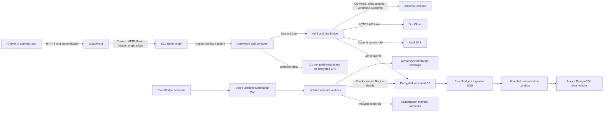

# Gatewatch threat model

**Version:** 1.2

**Last reviewed:** August 9, 2026

**Scope:** Current AWS web and collector deployment plus the planned SQS/Lambda/Aurora ingestion platform

## Security objectives

Gatewatch must preserve:

- **Confidentiality:** AWS inventory, account structure, security-group rules,
  resource attachments, tags, CloudTrail actors, notes, and credentials are visible
  only to authorized users and workloads.
- **Integrity:** Findings, evidence, exception decisions, owners, Jira links, and
  reports accurately represent the AWS source data and authorized human decisions.
- **Availability:** Malicious inputs or excessive requests cannot prevent the daily
  review workflow or block new evidence ingestion.
- **Accountability:** Every privileged action is attributable to a unique identity
  in a tamper-resistant audit record.
- **Tenant isolation:** A workspace cannot access or affect another workspace when
  multi-tenancy is enabled.
- **Least privilege:** A Gatewatch compromise does not become control of monitored
  AWS accounts.

## Architecture and data flow

The current production data store is the D1-compatible local database persisted
on encrypted EFS. The Aurora platform is represented by infrastructure and schema
code but was not deployed at the time of the original review. The August 3
implementation adds sharded organization collection and normalization code; the
target AWS deployment still requires environment validation.

## Trust boundaries

### Browser to CloudFront

The browser, uploaded files, query parameters, JSON bodies, and all displayed AWS
metadata are untrusted. Authentication, request size, rate, and authorization must
be enforced server-side.

### CloudFront to origin

The current origin trusts a CloudFront-injected token and source prefix-list
restriction. CloudFront forwards the viewer's Basic Authorization header to Nginx.
This boundary currently lacks TLS.

### Nginx to application

The application trusts `oai-authenticated-user-email`. Only the trusted proxy may
set this header. Nginx must always discard a viewer-supplied value before injecting
the verified identity. A future OIDC implementation should validate signed claims
inside a centralized authentication layer.

### Application to AWS/Jira bridge

The bridge has access to Secrets Manager, STS, S3, and Jira. Its bearer token is a
service credential, not a user authorization mechanism. Web and bridge workloads
must have separate least-privilege roles and isolation boundaries.

### Normalized evidence to Bedrock

AWS resource names, tags, intent, and actor text are hostile prompt input. The
application sends only the compact evidence package, delimits and escapes it,
applies the prompt-attack Guardrail, requires structured output, validates every
property and evidence reference, preserves the deterministic verdict, and falls
back locally on any failure. The model receives no raw logs or mutation
permissions. Model output remains untrusted content rendered as text.

### Gatewatch account to source accounts

Source-account operators deploy a role trusted by Gatewatch. Generated templates,
external IDs, role names, prefixes, and policies are security-sensitive. No
application-controlled string may alter the structure of the generated template.

### Collector and S3 evidence to decision engine

Snapshots control the findings analysts see. Encryption and versioning protect
storage but do not independently prove that the application consumed the intended
version or unmodified content. Snapshot manifests require verification and signing.

### Future organization ingestion to Aurora

Organization member accounts can forward events toward a central queue. Messages
must be bound to a registered source and workspace. Aurora must enforce workspace
separation even when application queries are wrong.

## High-value assets

| Asset | Why it matters | Primary controls required |
|---|---|---|
| AWS security-group evidence | Reveals network posture and drives findings | Encryption, integrity, source binding, least privilege |
| Resource names, attachments, and tags | Can expose application topology and customer data | Access control, retention, export safety |
| Review and exception decisions | Can suppress or justify exposure | Strong authorization, separation of duties, immutable audit |
| Web and service credentials | Permit application and integration access | Rotation, short lifetime, least privilege, no disclosure |
| Cross-account roles | Scale a compromise across AWS accounts | Read-only policies, boundaries, external IDs, Access Analyzer |
| Jira integration | Creates external records and contains an API token | Admin-only configuration, quotas, rotation, audit |
| Bedrock evidence package and output | May reveal posture or influence analyst decisions | Minimization, schema, citations, guardrails, budgets, audit, human approval |
| Release artifacts | Become executable production code | Signing, immutable versions, checksum verification, provenance |
| Audit evidence | Supports incident response and compliance | Unique identity, completeness, append-only external storage |

## Attacker personas

### Internet attacker

Attempts password guessing, credential stuffing, request flooding, parser abuse,
origin discovery, dependency exploitation, and information disclosure.

### Authenticated low-privilege user

Calls APIs directly to bypass the UI, changes review state, accesses other users'
objects, creates tickets, or approves risk without authority.

### Malicious application administrator

Generates dangerous cross-account templates, expands source scope, changes roles,
or manipulates audit and retention settings.

### Compromised source AWS account

Sends malformed logs or queue messages, creates adversarial tags and resource
names, and attempts to affect another source or workspace.

### Supply-chain attacker

Modifies a dependency, base image, build workstation, artifact bucket object, or
deployment script to obtain persistent execution.

### Compromised container or dependency

Attempts to reach IMDS, steal the instance profile, read Secrets Manager, access
the bridge, alter EFS data, and assume source-account roles.

### Insider or incident responder with excessive privilege

Changes or deletes audit evidence, extracts sensitive reports, or uses shared
credentials in a way that cannot be attributed.

## Priority abuse cases

| Abuse case | Security property | Required prevention |
|---|---|---|
| Shared password grants admin access | Authentication/accountability | OIDC identity, MFA, individual roles, throttling |
| Viewer approves an exception by direct API call | Authorization/integrity | Central permission and transition engine |
| Existing exception is updated using a false workflow kind | Business logic | Authorize from stored immutable type and owner |
| External ID injects IAM properties into generated YAML | Cross-account least privilege | Structured serialization and allowlist validation |
| Artifact object is replaced before SSM deployment | Supply-chain integrity | Version pinning, signature and checksum verification |
| Snapshot is replaced or malformed | Evidence integrity | Signed manifest, schema and count validation |
| Malicious AWS value becomes spreadsheet formula | Analyst endpoint security | Safe CSV cells or typed XLSX output |
| Container retrieves instance credentials | Privilege containment | Separate task roles and blocked IMDS |
| Large or repeated requests exhaust the instance | Availability | Streaming limits, quotas, WAF and rate limiting |
| Workspace predicate is omitted | Tenant isolation | PostgreSQL RLS and least-privilege database roles |
| AWS tag injects model instructions | Decision integrity/data confidentiality | Inert evidence boundary, prompt-attack filter, strict schema, citation/verdict checks, fallback |
| Parallel model calls exhaust budget | Availability/cost | Atomic per-user and workspace reservations, caching, request/output caps |
| Model proposes a dangerous change | AWS integrity | No mutation API/IAM, visible review-only drafts, approval forced server-side |

## Assumptions requiring validation

- Only CloudFront can reach the web origin.
- No external bucket policy grants artifact write access.
- Source roles are intended to be read-only and use a permission boundary.
- Raw CloudTrail and Config evidence remains governed in customer-controlled S3.
- Administrators require MFA and accepted risk requires independent approval.
- Multi-tenancy will be introduced when Aurora becomes the system of record.
- Central AWS logging, backup, and incident-response accounts are available.

## Review triggers

Repeat this threat model when any of the following changes:

- identity provider, session mechanism, or role model;
- public endpoint, CloudFront, ALB, VPC, container platform, or task roles;
- source-account trust policy or supported AWS Organizations topology;
- ingestion format, parser, upload limits, or snapshot signing;
- database engine, workspace model, or retention requirements;
- Jira or any new outbound integration;
- model, prompt, schema, Guardrail, inference Region, or AI evidence package;
- release, artifact, CI/CD, or secret-rotation process.
